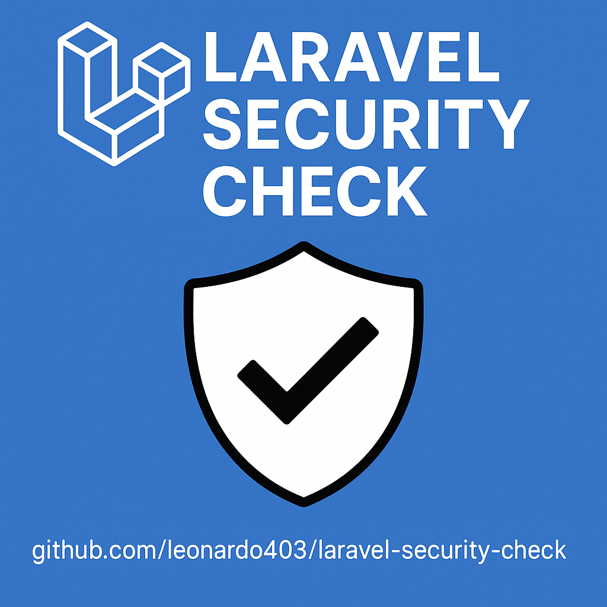

# Laravel Security Check

This project aims to provide tools and best practices to verify and improve the security of Laravel applications.

## Features

✅ Check for insecure configurations

✅ Analyze file and directory permissions

✅ Debugbar and Telescope
Make sure packages like barryvdh/laravel-debugbar and laravel/telescope are not enabled in production.

✅ APP_URL
Check if APP_URL is correctly configured for the production domain.

- APP_KEY
Already validating, but you can also check if it is not the default key (base64:... unchanged).

✅ Queue and Cache Drivers
Avoid using drivers like sync or file in production for QUEUE_CONNECTION and CACHE_DRIVER.

✅ Session Driver
Avoid SESSION_DRIVER=file in production, prefer redis or database.

✅ Mail Driver
Avoid MAIL_MAILER=log or MAIL_MAILER=array in production.

- Trusted Proxies
Make sure TRUSTED_PROXIES is set if you are behind a proxy/reverse proxy.

- CORS
Make sure your CORS settings are not too open.

- Logging
Avoid LOG_CHANNEL=stack with single in production, prefer daily or external systems.

✅ Public Directories
Make sure sensitive files (like .env, composer.lock, etc.) are not publicly accessible.

- Composer Autoload
Make sure autoload is optimized (composer dump-autoload -o).

- Config Cache
Make sure configs are cached (php artisan config:cache).

- Route Cache
Make sure routes are cached (php artisan route:cache).

✅ Debug Mode
Besides APP_DEBUG, make sure that there are no other debug modes active.

✅ Error Exposure
Check that APP_DEBUG is false and that there are no custom handlers exposing stack traces.

## How to use by cloning the repository

1. Clone the repository:
```
git clone https://github.com/leonardo403/laravel-security-check.git
```
2. Install the dependencies:
```
composer install
```
3. Run the security checks:
```
php artisan security:check
```

## Using with Composer Install
1. Install the package via Composer:
```
composer require elohim/laravel-security-check
```

2. After installation, you can run the security check command:
```
php artisan security:check
```

## Requirements

- PHP >= 8.0
- Composer
- Laravel >= 9.x

## Contribution

Contributions are welcome! Feel free to open issues or send pull requests.

## License

This project is licensed under the MIT License.
