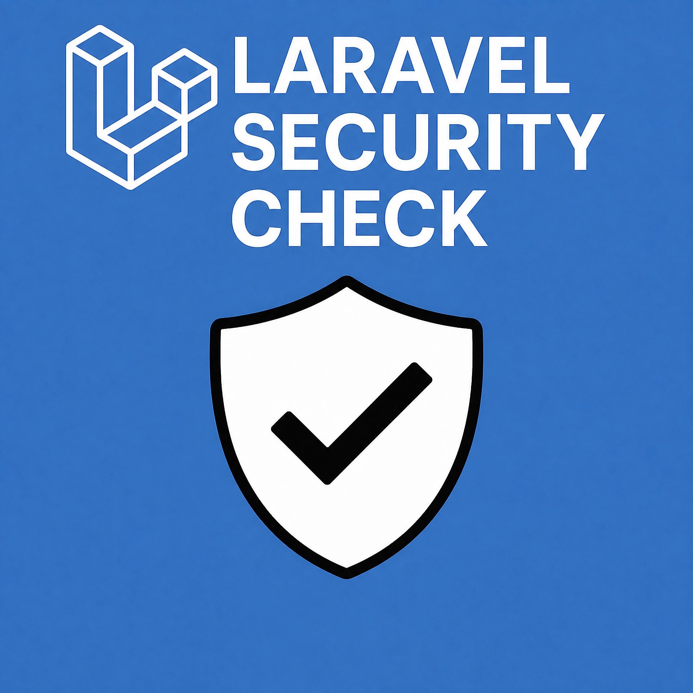

# Laravel Security Check

Laravel Security Check is a security analysis platform that helps teams catch flaws before they become incidents. In minutes, you get a clear view of the security posture of your projects.

## Features

The application runs a single scanner that validates `.env` configurations:

✅ **.env file**
Warns if a `.env` file is present, since environment variables should be used instead.

✅ **APP_DEBUG**
Warns if `APP_DEBUG=true`, as it should be set to `false` in production.

✅ **APP_ENV**
Warns if `APP_ENV` is not set to `production` in production environments.

✅ **APP_KEY**
Warns if `APP_KEY` is empty or invalid, suggesting running `php artisan key:generate`.

✅ **APP_URL**
Warns if `APP_URL` is set to `http://localhost`, suggesting the production URL.

✅ **DB_CONNECTION / DB_HOST**
Warns if using an in-memory SQLite database or if `DB_HOST` is not set correctly for MySQL in production.

✅ **DB_PORT**
Warns if `DB_PORT` is empty or not a valid port.

✅ **DB_DATABASE**
Warns if `DB_DATABASE` is not set.

✅ **DB_USERNAME**
Warns if `DB_USERNAME` is empty or set to `root`.

✅ **DB_PASSWORD**
Warns if `DB_PASSWORD` is empty or uses a weak/known password.

✅ **APP_URL**
Warns if `APP_URL` is set to the default localhost URL, suggesting using the production URL in production environments.

## How to use by cloning the repository

1. Clone the repository:
```
git clone https://github.com/leonardo403/laravel-security-check.git
```
2. Install the dependencies:
```
composer install
```
3. Run the security checks:
```
php artisan security:scan
```

## Using with Composer Install
1. Install the package via Composer:
```
composer require leonardolima/laravel-security-check
```

2. After installation, you can run the security check command:
```
php artisan security:scan
```

## Requirements

- PHP >= 8.2
- Composer
- Laravel >= 9.x

## Contribution

Contributions are welcome! Feel free to open issues or send pull requests.

## License

This project is licensed under the MIT License.
